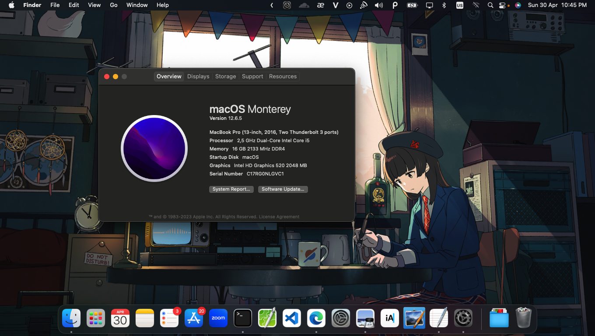
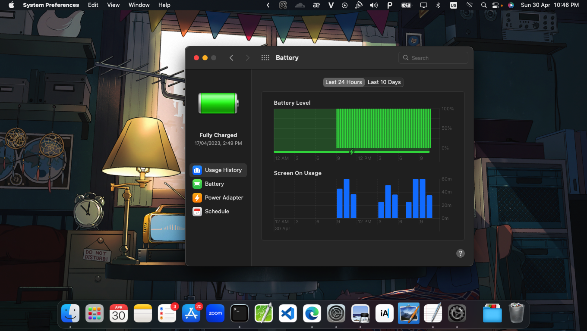
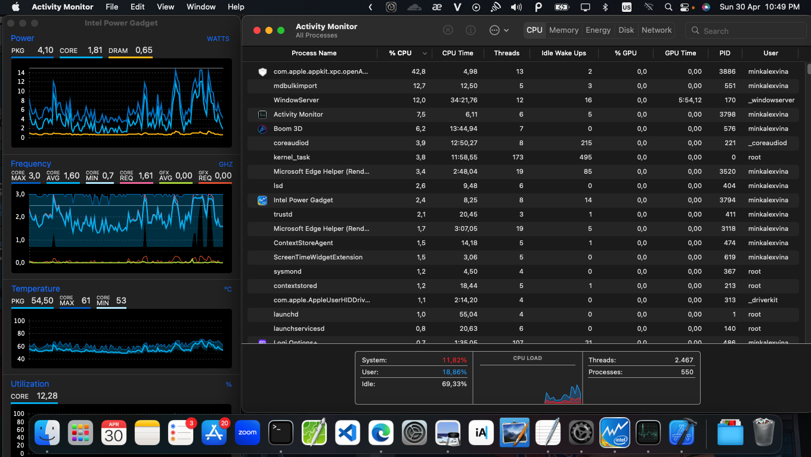

# macOS Monterey on ThinkPad X260

[](https://developer.apple.com/documentation/macos-release-notes)
[](https://github.com/acidanthera/OpenCorePkg)
[](https://pcsupport.lenovo.com/us/en/products/laptops-and-netbooks/thinkpad-x-series-laptops/thinkpad-x260/downloads/driver-list/component?name=BIOS%2FUEFI)

## UPDATE
Hi everyone. Apple is going to release MacOS 26. It is the last version supports Macbook running Intel chip, which also means the end of Hackintosh. After a long time using Hackintosh, I decided to switch to buy a Macbook running Apple Sillicon chip because of performance and time efficiency. Thank you for support me all this time ❤️

**DISCLAIMER:**  
Read the entire README before you start.  
I am not responsible for any damages you may cause.

## Specification
Specification | Configuration
----------- | -----------
Processor | Intel Core i5-6300U
Integrated Graphics | Intel HD Graphics 520
Memory | Kingston 16GB Solid DIMM 2666MHz DDR4
Storage | 256GB Patriot SSD
Wireless Card | Intel AC-8260 Dual Band + Bluetooth
Bootloader | OpenCore 0.9.1


## Screenshot
<p align="center">
  <br>M O N T E R E Y
  <br><br>
  
</p>
<details>
<summary><strong>More images</strong></summary>
<p align="center">
  <br>B A T T E R Y
  <br><br>
  
</p>
<p align="center">
  <br>S T A T S
  <br><br>
  
</p>
</details>  

## Installation (MUST DO)

<details>  
<summary><strong>Install and BIOS</strong></summary>

1. [Create an installation media](https://dortania.github.io/OpenCore-Install-Guide/installer-guide/#making-the-installer)
1. Download the latest EFI folder and copy it into the ESP partiton
1. Change your BIOS settings according to the table below
1. Boot from the USB installer (press `F12` to choose boot volume) and [start the installation process](https://dortania.github.io/OpenCore-Install-Guide/installation/installation-process.html#booting-the-opencore-usb)

| Menu     |                   |                                 | Setting     |
| -------- | ----------------- | ------------------------------- | ----------- |
| Config   | USB               | UEFI BIOS Support               | `Enable`    |
|          | Power             | Intel SpeedStep Technology      | `Enable`    |
|          |                   | CPU Power Management            | `Enable`    |
|          | CPU               | Hyper-Threading Technology      | `Enable`    |
| Security | Security Chip     |                                 | `Disable`   |
|          | Memory Protection | Execution Prevention            | `Enable`    |
|          | Virtualization    | Intel Virtualization Technology | `Enable`    |
|          |                   | Intel VT-d Feature              | `Enable`    |
|          | Anti-Theft        | Computrace                      | `Disable`   |
|          | Secure Boot       |                                 | `Disable`   |
|          | Intel SGX         |                                 | `Disable`   |
|          | Device Guard      |                                 | `Disable`   |
| Startup  | UEFI/Legacy Boot  |                                 | `UEFI Only` |
|          | CSM Support       |                                 | `No`        |
|          | Boot Mode         |                                 | `Quick`     |

</details>

<details>  
<summary><strong>Enable Apple Services</strong></summary>

1. Run the following script in Terminal

```bash
git clone https://github.com/corpnewt/GenSMBIOS && cd GenSMBIOS && chmod +x GenSMBIOS.command && ./GenSMBIOS.command
```

2. Type `3` to Generate SMBIOS, then press ENTER
3. Type `MacbookPro16,3 5`, then press ENTER. Leave this Terminal window open.
4. Open `/EFI/OC/Config.plist` with any editor and navigate to `PlatformInfo -> Generic`
5. Add the script's last result to `MLB, SystemSerialNumber and SystemUUID`

```diff
<key>PlatformInfo</key>
<dict>
   <key>Generic</key>
   <array>
      </dict>
         <key>AdviseWindows</key>
         <false/>
         <key>SystemMemoryStatus</key>
         <string>Auto</string>
         <key>MLB</key>
+        <string>M0000000000000001</string>
         <key>ProcessorType</key>
         <integer>0</integer>
         <key>ROM</key>
         <data>ESIzRFVm</data>
         <key>SpoofVendor</key>
         <true/>
         <key>SystemProductName</key>
         <string>MacBookPro13,3</string>
         <key>SystemSerialNumber</key>
+        <string>W00000000001</string>
         <key>SystemUUID</key>
+        <string>00000000-0000-0000-0000-000000000000</string>
      </dict>
   </array>
</dict>
```

6. Save and reboot the system

</details>

## Status

<details>  
<summary><strong>What's working ✅</strong></summary>

- CPU Power Management `~1W on IDLE`
- Intel HD 520 Graphics `incuding graphics acceleration`
- USB ports
- Internal camera `working fine on FaceTime, Skype, Zoom and others`
- Sleep / Hibernatemode `25 or 3` / Wake / Shutdown / Reboot
- Intel Gigabit Ethernet
- Wifi, Bluetooth, Airdrop, Handoff, Continuity, Sidecar wireless `some functionalities may be buggy or broken on Intel WLAN cards`
- iMessage, FaceTime, App Store, iTunes Store `Please generate your own SMBIOS`
- Speakers and headphones combo jack 
- Batteries
- Keyboard map and hotkeys with [ThinkPad Assistant](https://github.com/MSzturc/ThinkpadAssistant)
- Trackpad, Trackpoint and physical buttons
- HDMI `with digital audio passthrough`
- SD Card Reader

</details>

<details>  
<summary><strong>What's not working ⚠️</strong></summary>

- Safari DRM `Use Chromium engine to watch Apple TV+, Amazon Prime Video, Netflix and others`
- WWAN (never be supported because there is no kext for MacOS)
- Fingerprint Reader

</details>

## Thanks to:

- The hackintosh community on GitHub
- [Dortania](https://dortania.github.io/OpenCore-Install-Guide/)
- [r/hackintosh](https://www.reddit.com/r/hackintosh/)
